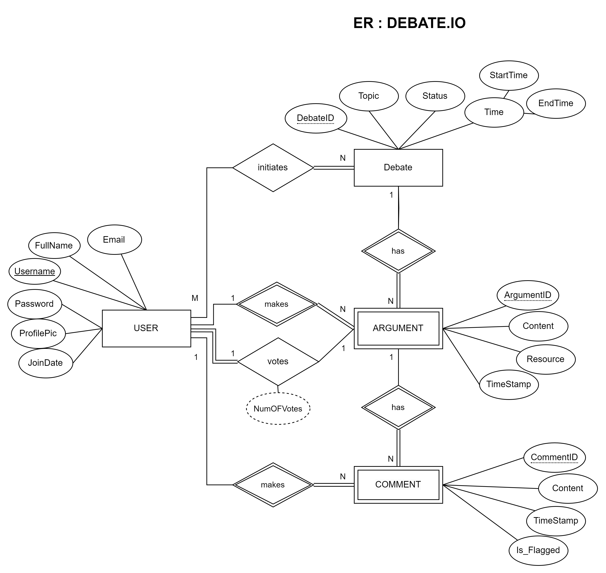
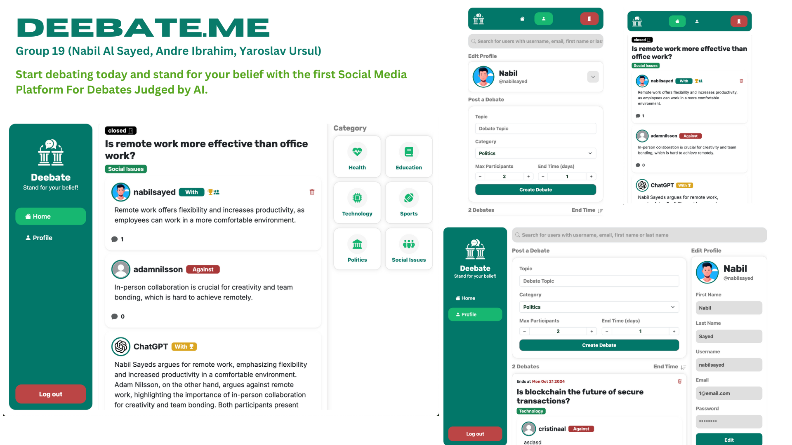

# Backend and Frontend Template

Latest version: https://git.chalmers.se/courses/dit342/group-00-web

This template refers to itself as `group-00-web`. In your project, use your group number in place of `00`.

## Project Structure

| File        | Purpose           | What you do?  |
| ------------- | ------------- | ----- |
| `server/` | Backend server code | All your server code |
| [server/README.md](server/README.md) | Everything about the server | **READ ME** carefully! |
| `client/` | Frontend client code | All your client code |
| [client/README.md](client/README.md) | Everything about the client | **READ ME** carefully! |
| [docs/LOCAL_DEPLOYMENT.md](docs/LOCAL_DEPLOYMENT.md) | Local production deployment | Deploy your app local in production mode |

## Requirements

The version numbers in brackets indicate the tested versions but feel free to use more recent versions.
You can also use alternative tools if you know how to configure them (e.g., Firefox instead of Chrome).

* [Git](https://git-scm.com/) (v2) => [installation instructions](https://www.atlassian.com/git/tutorials/install-git)
  * [Add your Git username and set your email](https://docs.gitlab.com/ce/gitlab-basics/start-using-git.html#add-your-git-username-and-set-your-email)
    * `git config --global user.name "YOUR_USERNAME"` => check `git config --global user.name`
    * `git config --global user.email "email@example.com"` => check `git config --global user.email`
  * > **Windows users**: We recommend to use the [Git Bash](https://www.atlassian.com/git/tutorials/git-bash) shell from your Git installation or the Bash shell from the [Windows Subsystem for Linux](https://docs.microsoft.com/en-us/windows/wsl/install-win10) to run all shell commands for this project.
* [Chalmers GitLab](https://git.chalmers.se/) => Login with your **Chalmers CID** choosing "Sign in with" **Chalmers Login**. (contact [support@chalmers.se](mailto:support@chalmers.se) if you don't have one)
  * DIT342 course group: https://git.chalmers.se/courses/dit342
  * [Setup SSH key with Gitlab](https://docs.gitlab.com/ee/ssh/)
    * Create an SSH key pair `ssh-keygen -t ed25519 -C "email@example.com"` (skip if you already have one)
    * Add your public SSH key to your Gitlab profile under https://git.chalmers.se/profile/keys
    * Make sure the email you use to commit is registered under https://git.chalmers.se/profile/emails
  * Checkout the [Backend-Frontend](https://git.chalmers.se/courses/dit342/group-00-web) template `git clone git@git.chalmers.se:courses/dit342/group-00-web.git`
* [Server Requirements](./server/README.md#Requirements)
* [Client Requirements](./client/README.md#Requirements)

## Getting started

```bash
# Clone repository
git clone git@git.chalmers.se:courses/dit342/group-00-web.git

# Change into the directory
cd group-00-web

# Setup backend
cd server && npm install
npm run dev

# Setup frontend
cd client && npm install
npm run serve
```

> Check out the detailed instructions for [backend](./server/README.md) and [frontend](./client/README.md).

## Visual Studio Code (VSCode)

Open the `server` and `client` in separate VSCode workspaces or open the combined [backend-frontend.code-workspace](./backend-frontend.code-workspace). Otherwise, workspace-specific settings don't work properly.

## System Definition

### Purpose

The purpose of this project is to create a platform where users can engage in structured debates on various topics. Users can either participate as Debaters and present their arguments for or against a given topic and as Observers, where they can comment on arguments and vote for the debator they think has made the stronger case. The system will track votes, and debators with more votes will accumulate points, which contribute to their ranking in the system.

### Pages

* Home Page: 
Displays an overview of the website, including active and popular debates. Users can browse debates, log in, or sign up.
Users can explore debates or proceed to log in for full functionality.
* Debate List Page (Extended scope): 
Shows a list of all available debates. Users can search for debates by topic, date, or popularity. 
Users can click on a debate to view its details and participate in voting or commenting.
* Debate Page: 
Displays the details of a specific debate, including the arguments from both debators.
Users can read arguments, cast their votes for the stronger argument, and leave comments.
* Create Debate Invite Page: 
Allows Debators to create a new debate by entering the topic, description, and initiate arguments by inviting users.
Debators can submit new debates or update/delete existing ones.
* Profile Page: 
Displays the user’s information, including their role (Debator or Voter), history of debates, and earned points.
Users can update their profile details, see their past activity, and check their ranking (if applicable).
* Login/Sign-up Page: 
Provides a form for users to log into the system or create a new account.
Users can enter their credentials to access debates or sign up if they are new.

### Proposal for a higher grade

The JudgeAPI is an advanced feature that leverages OpenAI's GPT models to automatically analyze debate arguments, factoring in user votes and likes, to determine the winner. This feature enhances our core platform by providing AI-driven, objective decisions on which side presents the stronger case, ensuring a fair and unbiased outcome at the conclusion of each debate.
This feature not only increases the platform's capabilities but also aligns with our goal of promoting structured and fair debates, making the experience more interactive and engaging for users. By automating the decision-making process, we ensure a fair and dynamic conclusion to each debate, while keeping users more involved throughout.

### Entity-Relationship (ER) Diagram



## Teaser (MS3)


