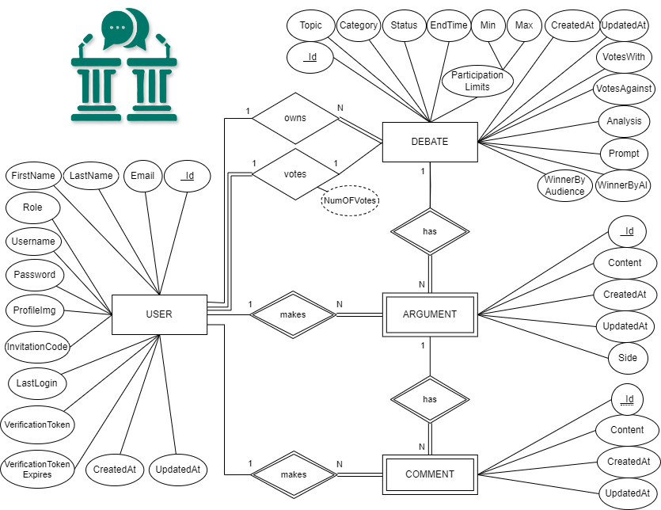

## Getting started

```bash
# Clone repository
git clone git@git.chalmers.se:courses/dit342/group-00-web.git

# Change into the directory
cd group-00-web

# Setup backend
cd server && npm install
npm run dev

# Setup frontend
cd client && npm install
npm run serve
```

> Check out the detailed instructions for [backend](./server/README.md) and [frontend](./client/README.md).

## Visual Studio Code

Open the `server` and `client` in separate VSCode workspaces or open the combined [backend-frontend.code-workspace](./backend-frontend.code-workspace). Otherwise, workspace-specific settings don't work properly.

## System Definition

### Purpose

The purpose of this project is to create a platform where users can engage in structured debates on various topics. Users can either participate as Debaters and present their arguments for or against a given topic and as Observers, where they can comment on arguments and vote for the debator they think has made the stronger case. The system will track votes, and debators with more votes will accumulate points, which contribute to their ranking in the system.

### Pages

- Home Page:
  Displays an overview of the website, including active and popular debates. Users can browse debates, log in, or sign up.
  Users can explore debates or proceed to log in for full functionality.
- Debate List Page (Extended scope):
  Shows a list of all available debates. Users can search for debates by topic, date, or popularity.
  Users can click on a debate to view its details and participate in voting or commenting.
- Debate Page:
  Displays the details of a specific debate, including the arguments from both debators.
  Users can read arguments, cast their votes for the stronger argument, and leave comments.
- Create Debate Invite Page:
  Allows Debators to create a new debate by entering the topic, description, and initiate arguments by inviting users.
  Debators can submit new debates or update/delete existing ones.
- Profile Page:
  Displays the user’s information, including their role (Debator or Voter), history of debates, and earned points.
  Users can update their profile details, see their past activity, and check their ranking (if applicable).
- Login/Sign-up Page:
  Provides a form for users to log into the system or create a new account.
  Users can enter their credentials to access debates or sign up if they are new.

### Advanced Feature

JudgeAPI for Fair and Automated Debate Conclusions
Objective: Implement the JudgeAPI to enhance the debate web application by providing automated, more unbiased analysis and conclusions for each debate. The JudgeAPI will ensure fairness by evaluating arguments based on predefined criteria and detecting any instances of "crossing the line" or inappropriate content.

Key Components:

- Automated Debate Conclusion:
  Function: Automatically determines the winner of the debate based on the strength and validity of arguments presented by each side.
  Implementation: Use OpenAI’s GPT models to analyze and compare arguments, providing a fair and unbiased assessment of which side presents a stronger case.

- Detailed Analysis Reports:
  Function: Generates detailed reports on the debate’s outcome, including strengths and weaknesses of each argument and reasons for the final decision.
  Implementation: Provide users with comprehensive feedback, including AI-driven insights into why a particular side won and suggestions for improving argument quality in future debates.

Form of Presentation:
The evaluation will be presented in form of a separate field below the final debate in the body of the debate component, and it will highlighted as Final AI Judge's Evaluation

### Entity-Relationship (ER) Diagram



## Teaser (MS3)

 
